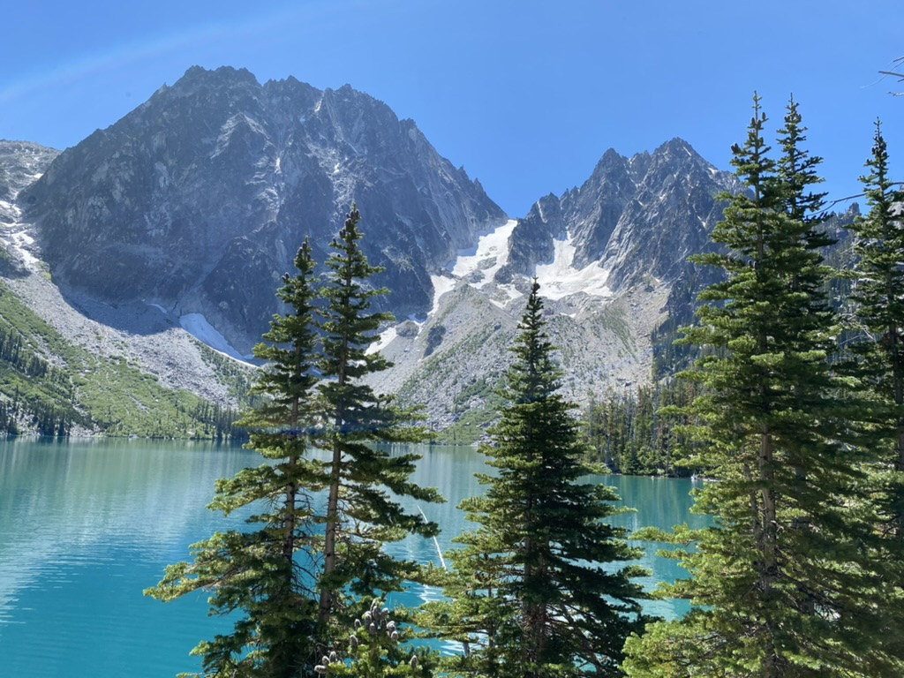
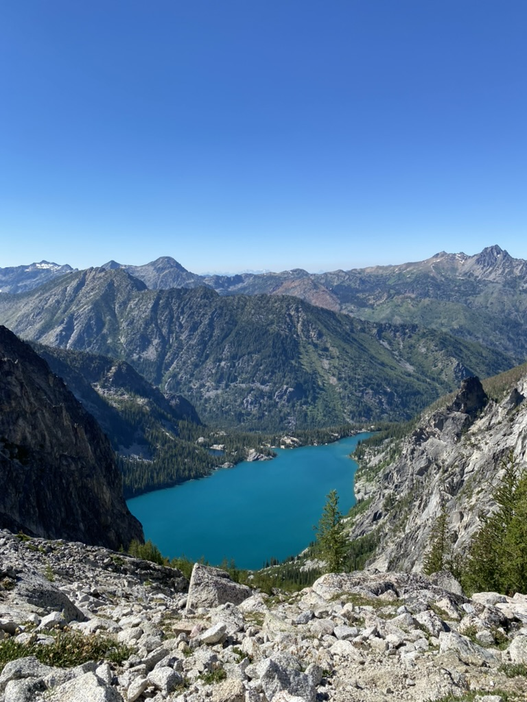
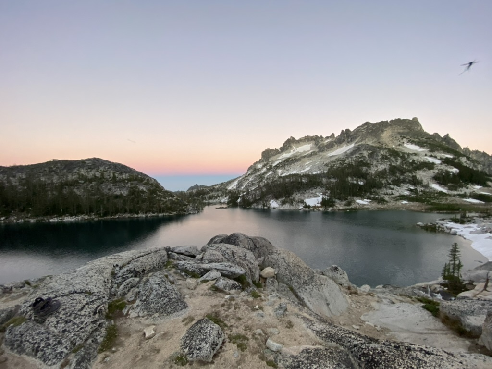
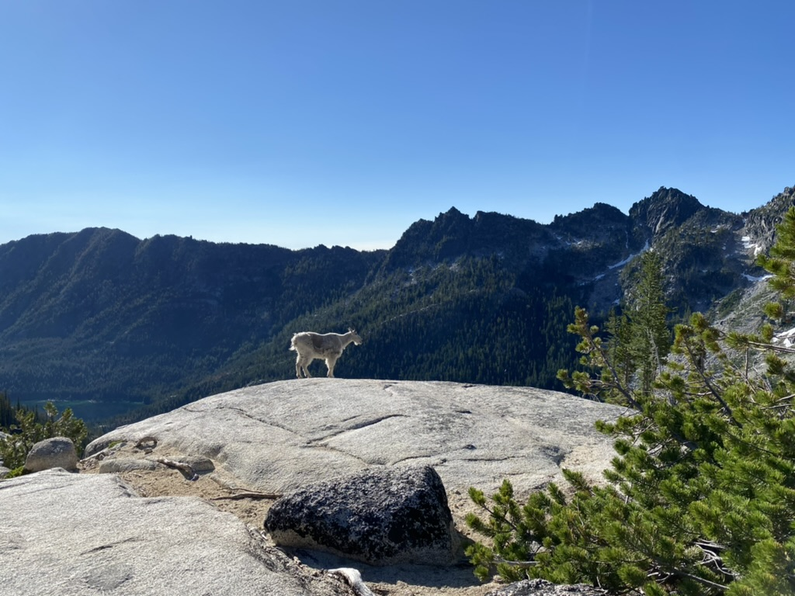
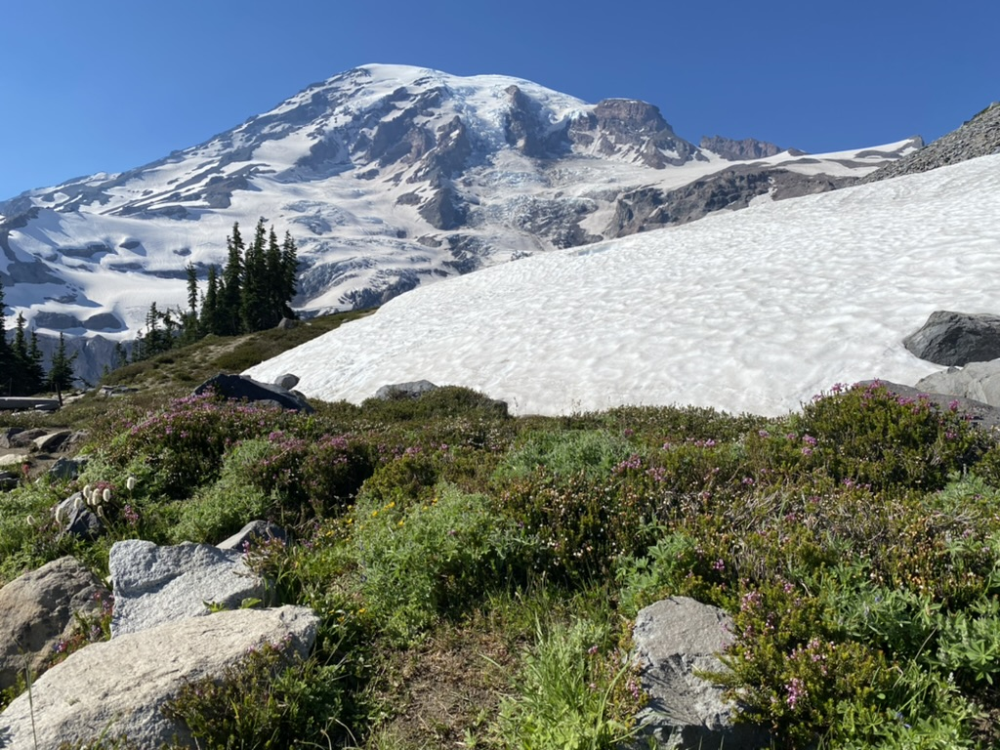
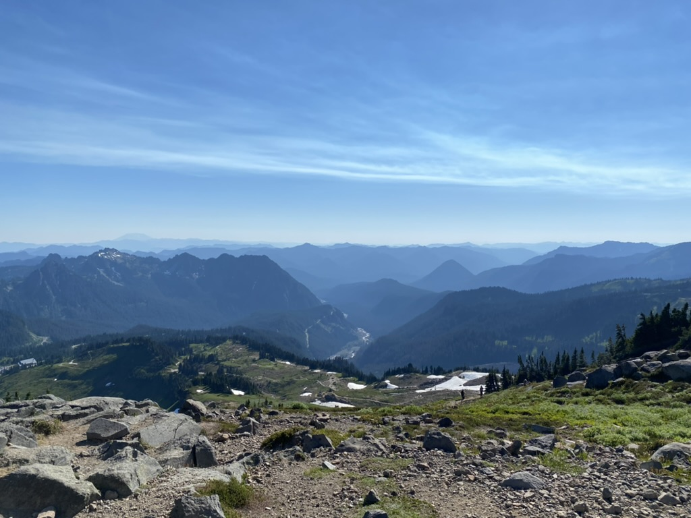

Leavenworth, WA
----

Trail:  [The Enchantments](https://www.alltrails.com/trail/us/washington/the-enchantments-trail)

Distance:  20.5 mi.

Notes:  Two-day backcountry excursion through all the lakes.  Beautiful trail with river crossings and plenty of elevation gain, especially Asgard Pass.  A couple of bear sightings and encounters with mountain goats.  Lots of mosquitoes during the summer -- next time, bring a rain jacket and mosquito net to keep them out.  Look forward to visiting Colchuk Lake again!  

Colchuk with a view of Asgard to the left

Colchuk from atop Asgard

Camp at Inspiration Lake

Lots of these fellows keeping us company

Mt. Rainier National Park
----

Trail:  [Skyline Loop](https://www.alltrails.com/trail/us/washington/skyline-trail)

Distance:  6.2 mi.

Notes:  Going up to the viewpoint clockwise is the key.  It gives you great views of Rainier on the way up that distract you from the climb, and views of Mt. St. Helens and Mt. Adams to the south on the way back down

ⓒ 2022